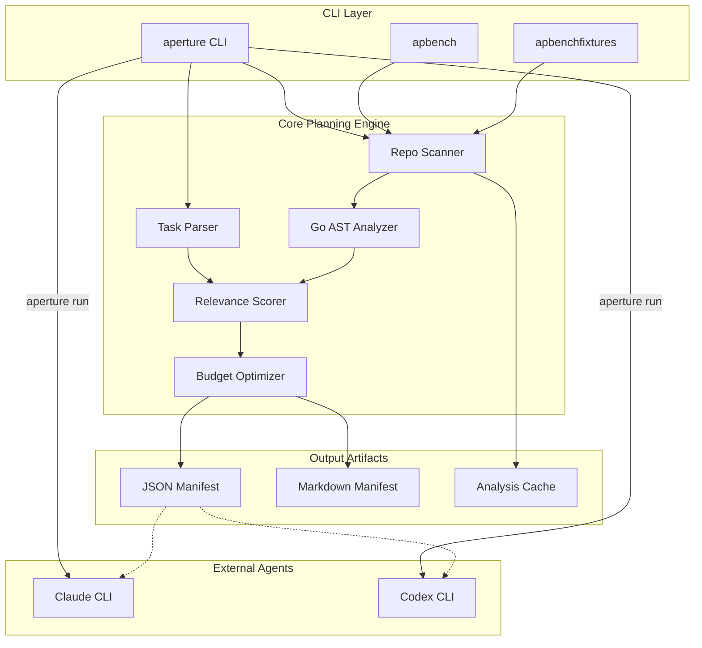

# Aperture Architecture Document

## 1. System Overview
Aperture is a Go-based pre-execution context planning tool designed to optimize the information provided to coding agents (such as Claude Code or Codex). Based on the detected components in `cmd/`, the system functions as a CLI-driven engine that analyzes a target repository and a specific task description to produce a deterministic, token-budgeted context manifest. This manifest identifies which files should be loaded in full, which should be summarized, and which remain reachable, while also detecting information gaps and assessing the feasibility of the task within a model's token constraints.

## 2. Components

### Primary Binary: aperture
*   **Source Files:** `cmd/aperture/main.go`
*   **Purpose:** The main entrypoint for the application. It provides the CLI interface for the `plan`, `explain`, `run`, and `version` commands. It orchestrates the internal pipeline, including task parsing, repository indexing, relevance scoring, and manifest generation.

### Benchmarking Utility: apbench
*   **Source Files:** `cmd/apbench/main.go`
*   **Purpose:** A technical utility used to execute performance benchmarks. As specified in the project's performance targets, this component measures wall-clock time for "cold" and "warm" planning cycles against standardized repository fixtures to ensure the system meets its latency requirements (e.g., < 1s for warm plans on small repos).

### Fixture Generator: apbenchfixtures
*   **Source Files:** `cmd/apbenchfixtures/main.go`
*   **Purpose:** A support utility dedicated to managing or generating the standardized repository fixtures (small, medium, and large) used by the benchmarking harness. This ensures that performance measurements are consistent across different development environments.

### Test Fixture: app
*   **Source Files:** `testdata/fixtures/small_go/cmd/app/main.go`
*   **Purpose:** A sample Go application entrypoint located within the test suite. It serves as a target for integration tests, allowing the system to validate Go AST extraction, symbol indexing, and relevance scoring against a real-world code structure.

## 3. Data Flow
The data flow within Aperture follows a linear pipeline from task ingestion to agent invocation:

1.  **Ingestion:** The user provides a task description (Markdown or text) and a repository root via the `aperture` CLI.
2.  **Task Parsing:** The `internal/task` package (referenced in `PLAN.md`) extracts anchors and classifies the action type (e.g., bugfix, feature) using deterministic keyword matching.
3.  **Repository Indexing:** The `internal/repo` and `internal/index` packages scan the filesystem. For Go files, `internal/lang/goanalysis` uses the Go standard library AST parser to extract symbols, imports, and package relationships.
4.  **Relevance Scoring:** The `internal/relevance` engine calculates a score for every file based on weighted signals like symbol matches, filename similarity, and import adjacency.
5.  **Budgeting & Selection:** The `internal/budget` package estimates token costs using model-specific tokenizers (Tiktoken or heuristics). A deterministic greedy algorithm selects the optimal context slice to fit the token budget.
6.  **Manifest Generation:** The system produces a SHA-256 hashed manifest in JSON and Markdown formats.
7.  **Agent Execution:** If the `run` command is used, the `internal/agent` package invokes an external adapter (e.g., the Claude CLI), passing the manifest and task as context.

## 4. External Dependencies
Based on the technical specifications and fact model, the system relies on the following:

*   **Go Toolchain:** Uses `go/ast`, `go/parser`, and `go/token` for language analysis.
*   **Tiktoken:** Embedded BPE tables (e.g., `o200k_base`, `cl100k_base`) for OpenAI/Codex token estimation.
*   **YAML v3:** For parsing the `.aperture.yaml` configuration file.
*   **Cobra:** For CLI command orchestration and flag handling.
*   **External Agents:** Integrates with the `claude` (Anthropic) and `codex` (OpenAI) CLI tools via process-level adapters.

## 5. Trust Boundaries
*   **Local Filesystem:** Aperture operates primarily within the local filesystem boundary. It requires read access to the target repository and write access to the `.aperture/` directory for caching and manifest storage.
*   **Adapter Execution:** A significant trust boundary exists at the `aperture run` command. The system executes external binaries (adapters) defined in the configuration. Users must trust the `command` strings defined in `.aperture.yaml`.
*   **Deterministic Hashing:** To ensure integrity, manifests are hashed (SHA-256). This allows downstream agents to verify that the context provided matches the plan generated by Aperture.
*   **No Exfiltration:** The architecture is "local-first," meaning repository source code is processed locally and not sent to external planning services.

## 6. Component Diagram

