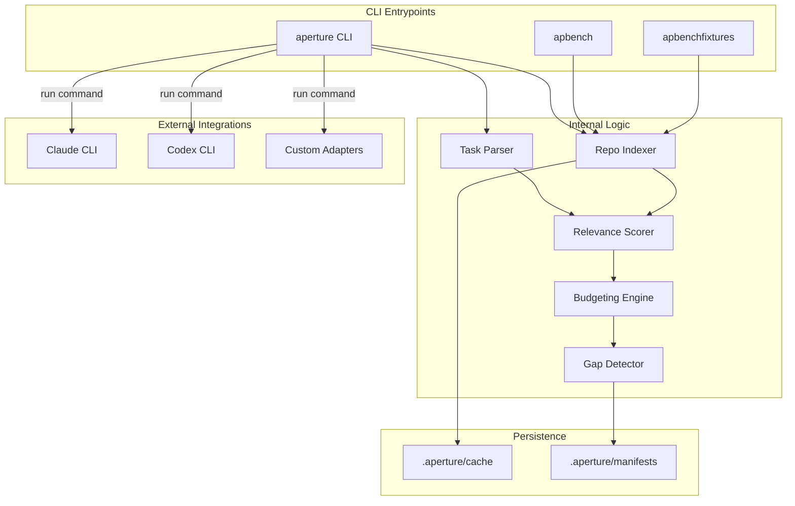

# Aperture Architecture Document

## 1. System Overview
Aperture is a Go-based pre-execution context planning tool designed for coding agents (such as Claude Code or OpenAI Codex). The system functions as a "context compiler" that sits between a developer's task description and a coding agent's execution. By analyzing a repository's structure, symbols, and imports, Aperture produces a deterministic, token-budgeted context manifest. This manifest specifies which files should be loaded in full, which should be summarized, and which are reachable but excluded, ensuring the downstream agent operates within model-specific token limits while maintaining high-confidence context.

## 2. Components

Based on the machine-extracted fact model and project specifications, the system is organized into the following primary components:

### 2.1 Binary Entrypoints
*   **aperture (`cmd/aperture/main.go`)**: The primary CLI entrypoint for the application. It facilitates the core workflows: `plan` (generating context manifests), `explain` (providing rationale for context selection), and `run` (executing downstream agent adapters).
*   **apbench (`cmd/apbench/main.go`)**: A performance benchmarking utility. As defined in the project specifications, this component measures planning pipeline performance against standardized repository fixtures to ensure the system meets strict latency targets (e.g., < 1s for warm-cache plans on small repos).
*   **apbenchfixtures (`cmd/apbenchfixtures/main.go`)**: A utility for generating standardized benchmark repository fixtures. These fixtures are used by `apbench` to provide reproducible performance metrics.
*   **app (`testdata/fixtures/small_go/cmd/app/main.go`)**: A sample Go application entrypoint used within the integration test suite to verify repository scanning and AST analysis capabilities.

### 2.2 Core Internal Logic (Inferred from SPEC/PLAN)
*   **Task Parser**: Processes raw task input into structured objectives and anchors using deterministic keyword matching.
*   **Repository Indexer**: Performs recursive file walking, applies exclusion rules, and executes Go-specific AST analysis to extract symbols and import relationships.
*   **Relevance Scorer**: Implements a multi-factor weighted scoring formula to determine the importance of repository artifacts relative to the task.
*   **Budgeting Engine**: Uses a deterministic greedy algorithm and embedded tiktoken/heuristic estimators to fit context into a model's token window.
*   **Agent Adapters**: Orchestrates the execution of external coding agents, providing them with the generated manifest and task context via environment variables and merged prompt files.

## 3. Data Flow

The Aperture pipeline follows a linear, deterministic path from task input to agent execution:

1.  **Input Acquisition**: The user provides a task description (Markdown, text, or inline) and a repository root to the `aperture` CLI.
2.  **Task Analysis**: The system parses the task to identify the `action_type` (e.g., bugfix, feature) and extracts a set of "anchors" (identifiers and filenames).
3.  **Repository Indexing**: The system scans the repository, generating a fingerprint and indexing Go symbols. It checks the local cache (`.aperture/cache/`) to accelerate this process.
4.  **Candidate Scoring**: Every file in the repository is assigned a relevance score based on factors like symbol matches, import adjacency, and filename similarity.
5.  **Context Selection**: The Budgeting Engine performs a two-pass greedy selection to assign `LoadModes` (full, structural_summary, behavioral_summary, or reachable) to files until the token budget is exhausted.
6.  **Manifest Generation**: The system produces a SHA-256 hashed JSON manifest and a human-readable Markdown manifest.
7.  **Agent Invocation (Run Mode)**: If using the `run` command, Aperture invokes a configured adapter (e.g., `claude`), passing the manifest data through environment variables like `APERTURE_MANIFEST_PATH`.

## 4. External Dependencies

The system is designed with a "standard-library first" philosophy, but utilizes specific external integrations:

*   **Coding Agents**: Integrates with external CLI tools including `claude` (Anthropic) and `codex` (OpenAI).
*   **Tokenizers**: Utilizes tiktoken-compatible BPE encoding tables (embedded in the binary) for OpenAI models and heuristic estimators for Claude models.
*   **Configuration**: Uses YAML for repository-level configuration (`.aperture.yaml`).
*   **CLI Framework**: Utilizes `cobra` for command routing and flag management.

## 5. Trust Boundaries

*   **Local Filesystem**: Aperture operates as a local-first tool. Its primary trust boundary is the repository root provided by the user. It reads source code and writes manifests/cache data to the `.aperture/` directory.
*   **Adapter Execution**: A critical trust boundary exists at the `aperture run` command. This command executes external binaries defined in the `.aperture.yaml` configuration. Users are responsible for auditing custom agent commands in the configuration file.
*   **Deterministic Hashing**: To ensure integrity and reproducibility, manifests include a deterministic hash that excludes volatile metadata (like PIDs or timestamps), allowing users to verify that identical inputs result in identical context plans.

## 6. Component Diagram

