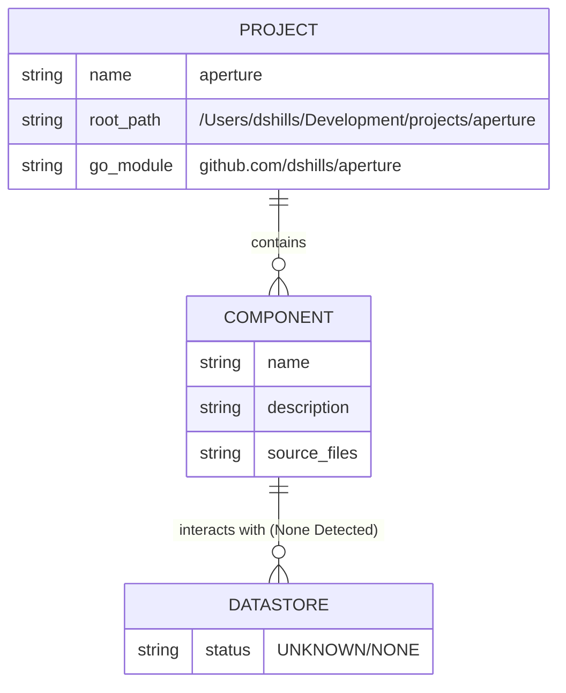

# Aperture Data Model Documentation

This document outlines the data model and persistence layer for the **aperture** project, as derived from the automated fact model analysis.

## 1. Metadata
- **Project Name:** aperture
- **Schema Version:** 1.0
- **Generated At:** 2026-04-18T11:42:40.00817Z
- **Root Path:** `/Users/dshills/Development/projects/aperture`
- **Primary Languages:** Go, Shell
- **Go Module:** `github.com/dshills/aperture`

---

## 2. Datastore Overview
Based on the provided fact model, no external datastores (SQL, NoSQL, or Caches) were explicitly detected within the analyzed source code.

| Datastore Name | Type | Description |
| :--- | :--- | :--- |
| **UNKNOWN** | **UNKNOWN** | No datastores detected in current analysis. |

---

## 3. Inferred Schemas
As no datastores were detected, there are no inferred schemas to report at this time.

### Entity: UNKNOWN
| Field | Type | PII | Description |
| :--- | :--- | :--- | :--- |
| **UNKNOWN** | **UNKNOWN** | **UNKNOWN** | **UNKNOWN** |

---

## 4. PII Assessment
No fields containing Personally Identifiable Information (PII) were identified in the current fact model.

> [!NOTE]
> If future scans detect user-related data, fields will be marked with ⚠️ **PII** warnings here.

---

## 5. Entity Relationship Diagram
The following diagram represents the relationship between the detected components and the (currently empty) data layer.

---

## 6. Detected Components
The following binary entry points (package main) were identified, which may serve as the primary consumers of data:

1.  **apbench**: Binary entrypoint (package main)
    *   Source: `cmd/apbench/main.go`
2.  **apbenchfixtures**: Binary entrypoint (package main)
    *   Source: `cmd/apbenchfixtures/main.go`
3.  **aperture**: Binary entrypoint (package main)
    *   Source: `cmd/aperture/main.go`
4.  **app**: Binary entrypoint (package main)
    *   Source: `testdata/fixtures/small_go/cmd/app/main.go`