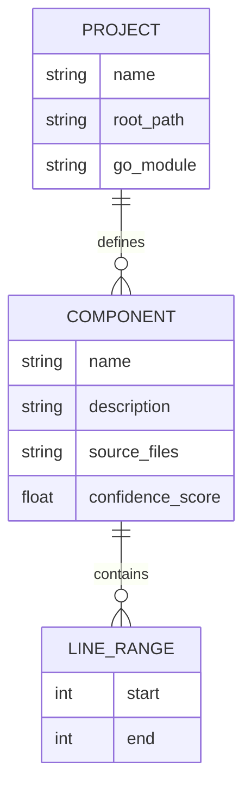

# Data Model Documentation: aperture

This document outlines the data architecture and storage components for the **aperture** project, as derived from the system analysis.

## 1. Metadata
- **Project Name:** aperture
- **Schema Version:** 1.0
- **Generated At:** 2026-04-18T11:28:22.939076Z
- **Go Module:** `github.com/dshills/aperture`
- **Primary Languages:** Go, Shell

---

## 2. Datastores and Inferred Schemas

Based on the provided fact model, no explicit datastores (SQL, NoSQL, or Caches) were detected within the analyzed source code.

| Datastore Name | Type | Description | Inferred Schema |
| :--- | :--- | :--- | :--- |
| **UNKNOWN** | **UNKNOWN** | No datastores detected in current analysis. | **UNKNOWN** |

---

## 3. PII Assessment
No fields containing Personally Identifiable Information (PII) were flagged in this analysis.

> [!NOTE]
> Security confidence score: 0. No security-related source files or line ranges were identified for data handling.

---

## 4. Entity-Relationship Diagram

The following diagram represents the relationship between the project and its identified functional components. Since no database entities were detected, this diagram reflects the structural components of the application.

---

## 5. Components Overview

The project consists of several binary entry points (package main). While these components do not currently define a data schema, they represent the execution context for the application logic.

| Component | Description | Source Entry Point |
| :--- | :--- | :--- |
| **apbench** | Binary entrypoint (package main) | `cmd/apbench/main.go` |
| **apbenchfixtures** | Binary entrypoint (package main) | `cmd/apbenchfixtures/main.go` |
| **aperture** | Binary entrypoint (package main) | `cmd/aperture/main.go` |
| **app** | Binary entrypoint (package main) | `testdata/fixtures/small_go/cmd/app/main.go` |

---

## 6. External Integrations & Jobs
- **APIs:** None detected (UNKNOWN)
- **Jobs:** None detected (UNKNOWN)
- **Integrations:** None detected (UNKNOWN)
- **Configuration:** None detected (UNKNOWN)